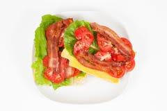

# TinyVLM: A Distilled and Quantized Vision-Language Model for Efficient Food Image-Text Retrieval in TinyML Settings

<p align="center">
  <a href="https://comsnets.org/aiot_workshop.html"></a>
  <a href="https://www.python.org/"></a>
  <a href="https://pytorch.org/"></a>
  
</p>

> **Accepted at COMSNETS 2026 — AIoT Workshop (Paper #1571214556)**

---

## Overview

**TinyVLM** is a compact, edge-deployable Vision-Language Model (VLM) designed for fine-grained food image-text retrieval in TinyML / AIoT settings. Built on the modular [nanoVLM](https://github.com/huggingface/nanoVLM) framework, it applies a three-stage compression pipeline — architectural downscaling, knowledge distillation, and dynamic INT8 post-training quantization — to reduce a 847 MB teacher model down to **111 MB**, while retaining **76.8%** retrieval accuracy (vs. 84.6% for the teacher).

> **Task:** Dishcovery: VLM MetaFood Challenge (CVPR 2025) — fine-grained food image-caption retrieval.

---

## Architecture

<!-- 
  Place the pipeline figure from the paper here.
  Extract from the PDF and save as: assets/pipeline.png
-->
<p align="center">
  
</p>

**Fig. 1:** The three-stage training and compression pipeline.
1. **Teacher** — A full-size VLM (SigLIP + SmolLM2) is contrastively fine-tuned on 364K food image-caption pairs.
2. **Student** — A structurally smaller model is trained to mimic the teacher's similarity distribution via KL-divergence distillation, in addition to its own contrastive loss.
3. **TinyVLM** — The distilled student is converted to INT8 via dynamic post-training quantization, producing the deployable model.

---

## Model Architecture

### Table I: Teacher vs Student Architecture

| Parameter | Teacher Model | Student Model |
|:----------|:-------------:|:-------------:|
| **Vision Encoder (SigLIP ViT)** | | |
| ViT Blocks | 12 | 6 |
| Hidden Dimension | 768 | 288 |
| **Language Model (SmolLM2)** | | |
| LM Blocks | 30 | 12 |
| Hidden Dimension | 576 | 288 |
| Attention Heads | 9 | 6 |
| **Total Parameters** | **220,312,128** | **50,145,216** |

The student achieves a **4.4× parameter reduction** through halved depth and narrowed hidden dimensions in both encoder and decoder.

---

## Training Objectives

**Contrastive Loss (InfoNCE):**

$$\mathcal{L}_{\text{contrastive}} = -\frac{1}{2N}\sum_{k=1}^{N}\left[\log\frac{e^{s_{k,k}/\tau}}{\sum_{j=1}^{N}e^{s_{k,j}/\tau}} + \log\frac{e^{s_{k,k}/\tau}}{\sum_{j=1}^{N}e^{s_{j,k}/\tau}}\right]$$

**Distillation Loss (KL divergence):**

$$\mathcal{L}_{\text{distill}} = \text{KL}\left(\text{softmax}(S_S / T) \;\|\; \text{softmax}(S_T / T)\right)$$

**Combined Student Loss:**

$$\mathcal{L}_{\text{student}} = (1 - \alpha)\,\mathcal{L}_{\text{contrastive}} + \alpha\,\mathcal{L}_{\text{distill}}$$

where $\alpha = 0.5$ and temperature $T = 2.0$.

---

## Results

### Table II: Main Experimental Results on Dishcovery Validation Set

| Model | Val Accuracy (%) | Model Size (MB) | Relative Size | CPU Latency (ms) |
|:------|:----------------:|:---------------:|:-------------:|:----------------:|
| Teacher VLM (FP32) | 84.6 | 847.17 | 1.00× | 94.7 |
| Student VLM (from scratch, FP32) | 71.2 | 847.17 | 1.00× | 91.3 |
| Student VLM (with Distillation, FP32) | 77.6 | 847.17 | 1.00× | 91.3 |
| **TinyVLM (Distilled + Quantized, INT8) *(Ours)*** | **76.8** | **111.11** | **0.13×** | **84.9** |

> TinyVLM retains **90.8%** of teacher accuracy at only **13.1%** of its storage footprint.

---

### Table III: Inference Performance on NVIDIA Jetson Orin Nano (8GB)

<!-- 
  Place the Jetson deployment figure here (if applicable).
  Save as: assets/jetson_deployment.png
-->

| Model | Latency (ms) | Throughput (FPS) |
|:------|:------------:|:----------------:|
| Teacher VLM (FP32) | 1967.72 | 0.51 |
| Student VLM (FP32) | 1875.33 | 0.52 |
| **TinyVLM (INT8, Quantized) *(Ours)*** | **1388.01** | **1.01** |

> **29.5% latency reduction** and **~2× throughput improvement** over the full-precision teacher on the Jetson.

---

### Table IV: Model Size and Resource Utilization on Jetson Orin Nano

| Model | Model Size (MB) | Peak Memory (MB) |
|:------|:---------------:|:----------------:|
| Teacher VLM (FP32) | 847.17 | 1293.54 |
| Student VLM (FP32) | 847.17 | 1244.53 |
| **TinyVLM (INT8, Quantized) *(Ours)*** | **111.11** | 2446.38 |

> Note: Peak memory for the quantized model is higher due to runtime dequantization buffers — a known characteristic of PyTorch dynamic quantization on dual-encoder architectures.

---

### Table V: Post-Training Quantization (PTQ) vs Quantization-Aware Training (QAT)

| Method | Val Accuracy (%) | Model Size (MB) |
|:-------|:----------------:|:---------------:|
| **PTQ (INT8)** | **76.8** | **111.11** |
| QAT (INT8) | 41.6 | 0.86 |

> PTQ substantially outperforms single-epoch QAT for this architecture. The compressed student's small capacity makes it sensitive to quantization noise during training. Extended QAT schedules remain a direction for future work.

---

## Qualitative Results

<!-- 
  Place the qualitative retrieval figure here.
  Extract from PDF and save as: assets/qualitative.png
-->
<p align="center">
  
</p>

**Fig. 2:** TinyVLM successfully retrieves fine-grained captions. For a complex dish image, the model identifies specific ingredients and preparation methods such as *"Grilled salmon with a creamy dill sauce and asparagus"* — demonstrating that distillation transfers nuanced cross-modal understanding from the teacher.

---

## Repository Structure

```
TinyVLM/
├── main.py                    # Full pipeline: teacher → distillation → PTQ → inference
├── main_qat.py                # QAT extension: fine-tune distilled student with fake-quant
│
├── configs/
│   └── config.py              # VLMConfig dataclass + global CONFIG dict
│
├── models/
│   └── vlm_wrapper.py         # VLMWrapper: contrastive dual-encoder around nanoVLM
│
├── data/
│   └── dataset.py             # UnifiedVLMDataset (web + synthetic splits) + collate_fn
│
├── training/
│   ├── losses.py              # contrastive_loss, distillation_loss, compute_accuracy
│   └── trainer.py             # train/validate/distill/QAT epoch loops
│
├── quantization/
│   └── quantize.py            # apply_dynamic_quantization, prepare_model_for_qat, convert_qat_model
│
├── inference/
│   └── inference.py           # load_test_data, run_inference, generate_submission
│
├── utils/
│   └── helpers.py             # cosine LR schedule, mean_pooling, measure_model_size_mb
│
├── benchmark/
│   └── benchmark.py           # CPU latency benchmark (warmup + timed runs)
│
├── scripts/
│   └── evaluate.py            # Multi-model evaluation + Table II / V generation
│
├── assets/                    # Figures for README (extracted from paper)
├── requirements.txt
└── .gitignore
```

---

## Setup

### 1. Clone the repository

```bash
git clone https://github.com/<your-username>/TinyVLM.git
cd TinyVLM
```

### 2. Create a virtual environment

```bash
python -m venv .venv
source .venv/bin/activate   # Windows: .venv\Scripts\activate
```

### 3. Install dependencies

```bash
pip install -r requirements.txt
```

### 4. Install nanoVLM

```bash
git clone https://github.com/huggingface/nanoVLM.git
cd nanoVLM && pip install -e . && cd ..
```

---

## Usage

### Full Training Pipeline (Teacher → Distillation → PTQ)

```bash
python main.py \
    --nanovlm_root /path/to/nanoVLM \
    --web_data_path /path/to/prepared_web_dataset \
    --test1_dir /path/to/Tests/Test1 \
    --test2_dir /path/to/Tests/Test2 \
    --output_dir outputs \
    --teacher_epochs 3 \
    --student_epochs 3
```

### QAT Extension (after main.py)

```bash
python main_qat.py \
    --nanovlm_root /path/to/nanoVLM \
    --web_data_path /path/to/prepared_web_dataset \
    --student_ckpt outputs/student_distilled.pt \
    --ptq_ckpt outputs/student_ptq_int8.pt \
    --qat_epochs 1 \
    --backend fbgemm          # use qnnpack for ARM (Jetson)
```

### CPU Latency Benchmark

```bash
python benchmark/benchmark.py \
    --nanovlm_root /path/to/nanoVLM \
    --teacher_ckpt outputs/teacher_final.pt \
    --student_ckpt outputs/student_distilled.pt \
    --quantized_ckpt outputs/student_ptq_int8.pt
```

### Evaluate All Models + Generate Tables

```bash
python scripts/evaluate.py \
    --nanovlm_root /path/to/nanoVLM \
    --web_data_path /path/to/prepared_web_dataset \
    --teacher_ckpt outputs/teacher_final.pt \
    --student_ckpt outputs/student_distilled.pt \
    --ptq_ckpt outputs/student_ptq_int8.pt \
    --qat_ckpt outputs/student_qat_int8.pt \
    --output_dir outputs
```

### Skip Phases with Existing Checkpoints

```bash
# Skip teacher training if checkpoint exists
python main.py --skip_teacher --student_epochs 3 ...

# Skip distillation too (PTQ only)
python main.py --skip_teacher --skip_distil ...
```

---

## Dataset

We use the **[Dishcovery: VLM MetaFood Challenge Dataset](https://www.kaggle.com/competitions/dishcovery-vlm-metafood-challenge)** (CVPR 2025):

| Split | Samples |
|:------|--------:|
| Web (training) | ~345,000 |
| Synthetic (training) | ~19,000 |
| Validation | 19,185 |

Images are resized to **224 × 224** pixels and captions tokenised to a maximum of **128** tokens.

---

## Training Setup

All experiments were run on a single **NVIDIA RTX A2000 (12 GB VRAM)**:

| Hyper-parameter | Value |
|:----------------|:-----:|
| Batch size | 8 |
| Gradient accumulation | 4 (effective: 32) |
| Teacher epochs | 3 |
| Student epochs | 3 |
| Optimizer | AdamW |
| LR (modality projector) | 1 × 10⁻⁴ |
| LR (backbones) | 1 × 10⁻⁵ |
| LR (student distillation) | 5 × 10⁻⁵ |
| LR schedule | Cosine with 500 warmup steps |
| Weight decay | 0.01 |
| Distillation α | 0.5 |
| Distillation temperature | 2.0 |
| Mixed precision | FP16 (AMP) |

---

## Backbones

| Component | Model |
|:----------|:------|
| Vision Encoder | [google/siglip-base-patch16-224](https://huggingface.co/google/siglip-base-patch16-224) |
| Language Model | [HuggingFaceTB/SmolLM2-135M](https://huggingface.co/HuggingFaceTB/SmolLM2-135M) |
| VLM Framework | [nanoVLM](https://github.com/huggingface/nanoVLM) |

---

## Citation

If you find this work useful, please cite:

```bibtex
@inproceedings{tinyvlm2026,
  title     = {TinyVLM: A Distilled and Quantized Vision-Language Model for
               Efficient Food Image-Text Retrieval in TinyML Settings},
  author    = {Podakanti Satyajith Chary and Pithani Teja Venkata Ramana Kumar
               and Nagarajan Ganapathy},
  booktitle = {Proceedings of COMSNETS 2026 -- AIoT Workshop},
  year      = {2026},
  address   = {Bengaluru, India},
}
```

---

## Acknowledgements

This work was conducted at IIT Hyderabad under the supervision of **Prof. Nagarajan Ganapathy** (Department of Biomedical Engineering). We thank the organisers of the Dishcovery: VLM MetaFood Challenge (CVPR 2025) for the dataset and evaluation platform.

---

## License

This project is released under the [MIT License](LICENSE).
